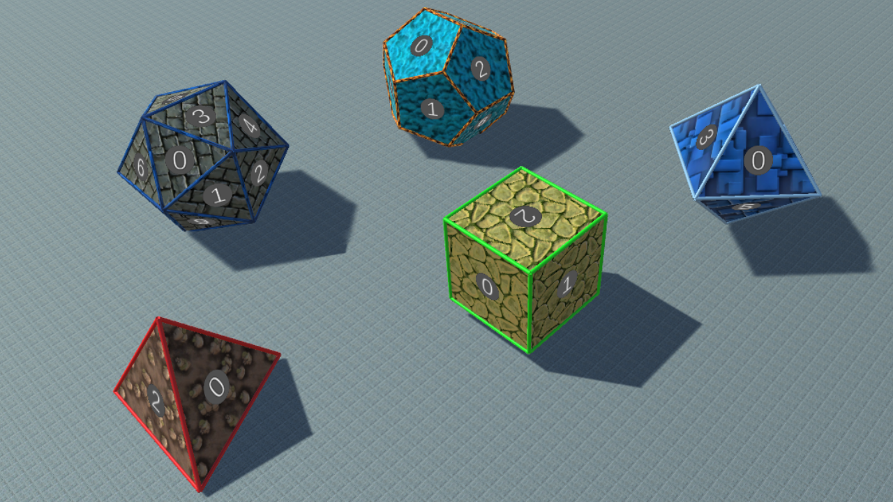

# A game about unfoldings

This is one of the games I am creating in my journey to learn game developement, and of course mix it with mathematics.

The main theme of this game is about the connection between the 3d and 2d world. While we are living in a 3d world, it is much easier to understand 2d objects, and in many cases we use 2d "cuts" of 3d objects in order to understand them. There are sections (actual cuts), projections, and in this game case [unfolding](https://en.wikipedia.org/wiki/Net_(polyhedron)).

You should have in mind a standard cube made of paper, where you are allowed to cut along its edges until you can fully unfold it on the table. Up to rotations and reflections, there are 11 results:

There are other nice polyhedrons which can be unfolded, and in particular the 5 [platonic solids](https://en.wikipedia.org/wiki/Platonic_solid) as in the image above (generated from the game). 

I still need to think how to use this idea and actually create a game, but as usual, this is already a source of interesting mathematics, and I made a couple of videos about them:
1. **Math and texture**: the mathematics of using 2d texture on 3d object.
	a. [English version](https://youtu.be/K_BulUdx3CQ)
	b. [Hebrew version](https://youtu.be/29cLQbvwLlc)
2. **Symmetries of polyhedrons**: Using symmetries to (easily...) construct the regular polyhedrons, and learning about their dual nature.
	a. [English version](https://youtu.be/wQn7MA4Ew1k)
	b. [Hebrew version](https://youtu.be/d6p7wBiWOno)

In general, you can find more videos about other mathematical games I am develpoing in these youtube accounts.

---

**My homepage**: [https://prove-me-wrong.com/](https://prove-me-wrong.com/)

**Contact**:	 [totallyRealField@gmail.com](mailto:totallyRealField@gmail.com)

**Ofir David**
